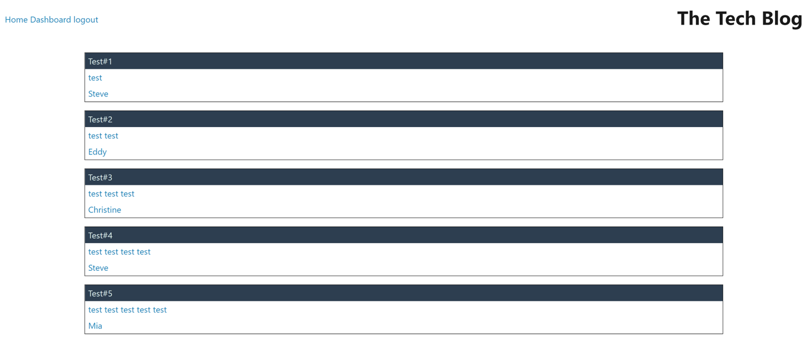
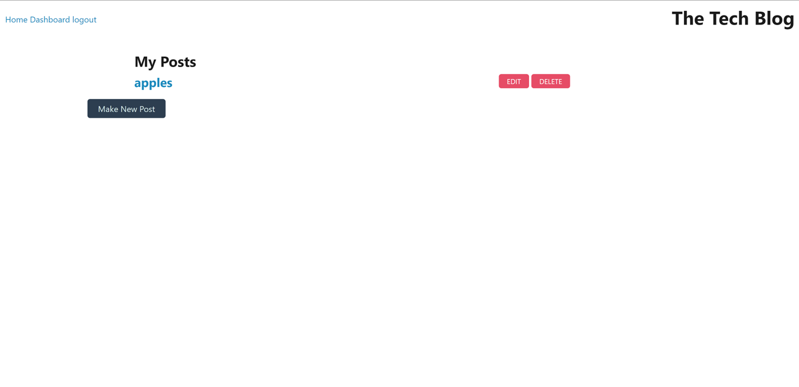

# e-commerce
## Installation
After downloading the code from the repository, the dependencies must be installed. This app uses dependencies such as dotenv, sequelize, express, etc. These dependencies are also listed in the app's package.json file. The app also uses a mysql database called 'tech_blog_db'. Before running the app this database must be created. Users may choose to create the database independently through mysql, or they can choose to implement the code written in 'schema.sql' in the 'db' folder of the source code using mysql. 

## Usage
After downloading the source code and installing all dependencies, the user must run the app on their local server using node. Once running, the app can be viewed in the browser. Users can choose to login, create and account, make a blog post, view other blog posts, and comment on other blog posts. Users can choose to create their own data to start or they can use the seed data by running the seed in the command line.

[deployment link](https://oguerra9.github.io/tech-blog/)
[GitHub repository](https://github.com/oguerra9/tech-blog)